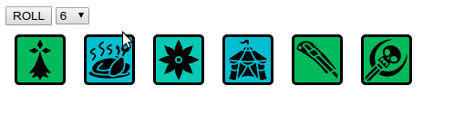

# vue-dice-roller

[ ](https://www.npmjs.com/package/vue-dice-roller)
[](https://vuejs.org/)

A Dice Roller Vue.js component with images. Like story cubes.



You can check an example here http://vitomd.com/vue-dice-roller/example.html


Note to self, to generate icon list
```
  printf "https://raw.githubusercontent.com/vitogit/vue-dice-roller/master/src/icons/%s?sanitize=true\',\n\'" * > _list.js
```

# License

Idea based on https://github.com/treetrnk/storygen/

The icons used are from http://game-icons.net/ the author is https://github.com/Delapouite

It has a CC BY 3.0 license so use this component or the icons you must credit him for his work.


## Installation

```
npm install --save vue-dice-roller
```

## Default import

Install all the components:

```javascript
import Vue from 'vue'
import VueDiceRoller from 'vue-dice-roller'

Vue.use(VueDiceRoller)
```


**⚠️ A css file is included when importing the package. You may have to setup your bundler to embed the css in your page.**

## Distribution import

Install all the components:

```javascript
import 'vue-dice-roller/dist/vue-dice-roller.css'
import VueDiceRoller from 'vue-dice-roller/dist/vue-dice-roller.common'

Vue.use(VueDiceRoller)
```

**⚠️ You may have to setup your bundler to embed the css file in your page.**

## Browser

```html
<link rel="stylesheet" href="vue-dice-roller/dist/vue-dice-roller.css"/>

<script src="vue.js"></script>
<script src="vue-dice-roller/dist/vue-dice-roller.browser.js"></script>
```

```javascript
    Vue.use(VueDiceRoller)
```

# Example

Full Example. You can check it online here: http://vitomd.com/vue-dice-roller/example.html
```
      <div id="app">
        <button @click="roll">ROLL</button>
        <select v-model="diceCount">
          <option v-for="index in 10" :value="index">{{index}}</option>
        </select>
        <dice-roller ref="diceroller" :count="diceCount"/>
      </div>

     <script>
        Vue.use(VueDiceRoller)
        new Vue({
          el: '#app',
          data () {
            return {
              diceCount: 6
            }
          },
          methods: {
            roll() {
              console.log("this.$refs",this.$refs)
              this.$refs.diceroller.roll();
            }
          }
        })
     </script>
```


Will roll 5 dices with random color backgrounds
```
    <dice-roller ref="diceroller" :count="5"/>
```

Will roll 3 dices with white backgrounds
```
    <dice-roller ref="diceroller" :count="3" :whiteBackground="true"/>
```
